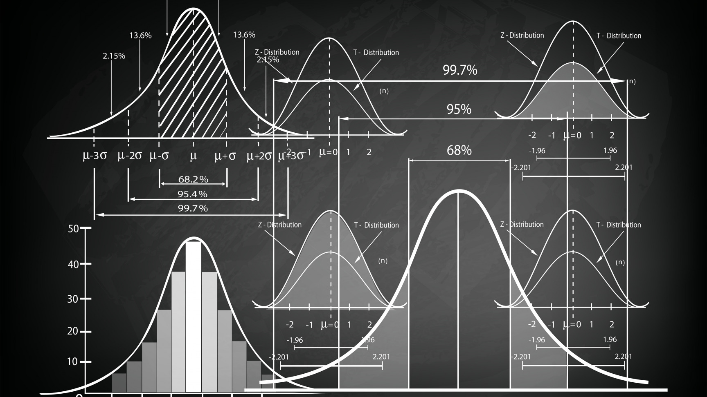

## Hi, everybody! 👋🏻

</a>

### Welcome to my GitHub repo. A place where you can find most of my research interests, teaching material and other stuff. I'm José Caro, an interim professor working in statistics, econometrics, data science and machine learning applied to finance and economics at The University of Córdoba, Spain. I share all of my university content to support students, scholars and working professionals interested to learn about data science and quantitative methods applied to social sciences. </a> 

### What do I do: 🧑🏼‍💻

### Computer Skills: 🖥️

- **Fluent:** R, R-Studio, Python, Markdown, LaTeX and Ti*k*z. 
- **Familiar:** Matlab, Quarto, VSCode.
- **Novice:** Julia, C++, Java.

### Research Interests: 📜 

- Applied Statistics and Econometrics to Financial Markets.
- Demography and Demographic Models.
- Computational Methods for Quantitative Finance.
- Econophysics.
- Machine Learning for Economics and Finance.

  
  
  
  
  
